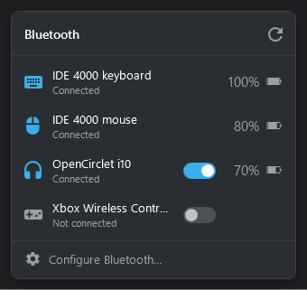

# bluetooth-taskbar-app

Ein leichtgewichtiges Tray-Applet für Windows 11, das die Bluetooth-Schnellein­stellungen
ersetzt. Optik und Bedienung orientieren sich am Bluetooth-Widget von KDE Plasma
(Breeze Dark): Kopfzeile, flache Geräteliste mit Verbinden-Schalter und Akkustand,
Fußzeile mit Verweis in die Systemeinstellungen.



## Funktionen

- Gekoppelte Geräte mit Live-Aktualisierung
- Verbinden und Trennen per Schalter
- Akkustand für Geräte, die ihn melden; unter 30 % orange hervorgehoben
- Warnung bei niedrigem Akku: Liegt ein verbundenes Gerät unter 30 %, erscheint alle drei
  Minuten für 15 Sekunden ein Hinweis unten rechts, begleitet vom Windows-Ton für
  schwachen Akku. Der Hinweis landet nicht in der Mitteilungszentrale.
- Tray-Icon mit der Anzahl verbundener Geräte; folgt dem hellen bzw. dunklen Taskbar-Theme
- Kontextmenü (Rechtsklick): Refresh, Bluetooth settings, Exit

Bewusst **nicht** enthalten: Adapter ein-/ausschalten sowie Suchen und Koppeln
neuer Geräte. Dafür führt die Fußzeile in die Windows-Einstellungen.

Die Oberfläche ist englisch.

## Installieren

Unter **Releases** die `bluetooth-taskbar-app-win-Setup.exe` der neuesten Version laden
und ausführen. Das Setup braucht keine Adminrechte, legt eine Startmenü- und eine
Autostart-Verknüpfung an und installiert die .NET 10 Desktop Runtime mit, falls sie
fehlt. Die Exe ist nicht signiert; SmartScreen warnt deshalb beim ersten Start
(„Weitere Informationen“ → „Trotzdem ausführen“).

Windows 11 versteckt Tray-Icons neuer Apps zunächst im Überlauf. Das Icon einmal per
Drag-and-drop in die Taskbar ziehen, dann bleibt es sichtbar.

Deinstalliert wird über *Einstellungen → Apps*.

## Updates

Die installierte App sucht beim Start und danach alle sechs Stunden nach einer neuen
Version und lädt sie im Hintergrund. Ist eine geladen, bietet das Tray-Menü
„Restart to update to …“ an; ohne diesen Klick wird das Update beim nächsten
Beenden eingespielt.

## Bekannte Einschränkungen

- Bluetooth-Mäuse, -Tastaturen und -Gamepads mit LE lassen sich verbinden, aber
  nicht trennen; solange sie verbunden sind, fehlt ihr Schalter.
- LE-Verbindungen, die die App hergestellt hat, enden beim Beenden der App.
- Bei ungewöhnlichen Geräten kann das Verbinden fehlschlagen; die Zeile zeigt dann
  kurz den Fehler.
- Die Liste zeigt nur gekoppelte Geräte.
- Das Flyout gibt es nur in Dark Mode.

Die Gründe stehen in [docs/verbindungen.md](docs/verbindungen.md).

## Aus dem Quellcode bauen

Voraussetzung ist das .NET 10 SDK.

```powershell
dotnet build source
dotnet run --project source/bluetooth-taskbar-app -- --show
```

`--show` öffnet das Flyout direkt, ohne Klick aufs Tray-Icon. Lokale Builds suchen
nicht nach Updates.

## Branches und Releases

Entwickelt wird auf `develop`. Der Branch `release` enthält immer den Stand der
zuletzt veröffentlichten Version.

Jeder Push auf `release` veröffentlicht die `<Version>` aus
`source/Directory.Build.props`: GitHub Actions baut Setup und Update-Pakete, erzeugt
den Tag `vX.Y.Z` und veröffentlicht das Release. Gibt es die Version schon, bricht der
Workflow ab, ohne etwas zu veröffentlichen.

**Versionsschema:** `develop` trägt immer schon die nächste Minor-Version.

- **Release:** `develop` per Merge-Commit nach `release` mergen. Direkt danach auf
  `develop` die Minor-Version erhöhen (z. B. 1.2.0 → 1.3.0).
- **Hotfix:** direkt auf `release` korrigieren und dabei die Patch-Version erhöhen
  (z. B. 1.2.0 → 1.2.1). Danach `release` zurück nach `develop` mergen, die Version
  von `develop` aber behalten — beim Konflikt in `Directory.Build.props` gewinnt
  `develop`.

```powershell
# Release
git switch release
git merge --no-ff develop -m "Release 1.2.0"
git push
git switch develop
# <Version> auf 1.3.0 setzen, committen, pushen

# Hotfix zurückholen
git switch develop
git merge --no-ff release
# Konflikt in source/Directory.Build.props: Version von develop behalten
```

Technische Hintergründe: [docs/architektur.md](docs/architektur.md).
